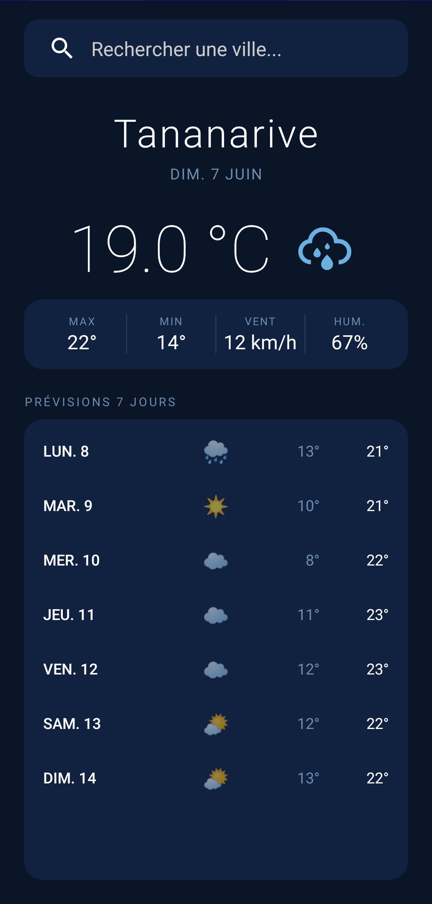

# 🌤️ Météo — Application Android

> Application Android de météo développée en Java, avec récupération des données en temps réel via **Open-Meteo API**.  
> Projet réalisé dans le cadre du cours de développement mobile.

---

## 📸 Aperçu des écrans

| Écran 1 — Accueil | Écran 2 — Résultats | Écran 3 — Non trouvé |
|:-:|:-:|:-:|
|  |  |  |

---

## ✅ Fonctionnalités

- 🔍 **Rechercher** une ville dans le monde entier
- 🌡️ **Afficher** la température actuelle en temps réel
- 📅 **Afficher** la date du jour en français
- ⬆️⬇️ **Consulter** les températures max et min du jour
- 💨 **Voir** la vitesse du vent en km/h
- 💧 **Voir** le taux d'humidité en pourcentage
- 🗓️ **Prévisions 7 jours** avec icône météo et températures
- 🎨 **Icônes colorées** adaptées à chaque condition météo
- 🚫 **Gestion d'erreurs** : message informatif si la ville n'est pas trouvée

---

## 🏗️ Architecture du projet

```
mg.carlos.meteo/
├── MainActivity.java      # Écran principal (recherche + affichage)
├── ForecastAdapter.java   # Adapter pour la liste des prévisions
├── ForecastDay.java       # Modèle de données pour une ligne de prévision
└── res/
├── anim/
│   └── fade_in.xml    # Animation d'apparition
├── drawable/
│   └── ic_wi_*.xml    # Icônes météo SVG
└── layout/
├── activity_main.xml      # Layout de l'écran principal
└── item_forecast_row.xml  # Layout d'une ligne de prévision
```

---

## 🌐 APIs utilisées

### Open-Meteo Geocoding API
Convertit un nom de ville en coordonnées GPS.
`GET https://geocoding-api.open-meteo.com/v1/search?name=Paris&count=1&language=fr&format=json`

### Open-Meteo Weather API
Récupère la météo actuelle et les prévisions à partir des coordonnées.
`GET https://api.open-meteo.com/v1/forecast?latitude=48.856&longitude=2.352&current=temperature_2m,relative_humidity_2m,wind_speed_10m,weather_code&daily=temperature_2m_max,temperature_2m_min,weather_code&forecast_days=8&timezone=auto`

---

## 📦 Structure des données

### Codes météo WMO

| Code  | Condition  | Icône |
|-------|------------|-------|
| 0     | Soleil     | ☀️ |
| 1–3   | Nuageux    | ⛅    |
| 45–48 | Brouillard | 🌫️   |
| 51–55 | Bruine     | 🌦️   |
| 61–65 | Pluie      | 🌧️   |
| 71–75 | Neige      | ❄️ |
| 80–82 | Averses    | 🌧️   |
| 95–99 | Orage      | ⛈️ |

---

## 🛠️ Technologies utilisées

| Technologie        | Usage                |
|--------------------|----------------------|
| **Java**           | Langage principal    |
| **Android SDK**    | Framework mobile     |
| **Volley**         | Requêtes HTTP        |
| **RecyclerView**   | Liste des prévisions |
| **Open-Meteo API** | Données météo        |

---

## 🚀 Installation

### Prérequis

- **Android Studio Chipmunk | 2021.2.1 Patch 1**
- **Java 11** (OpenJDK 11.0.12 — fourni avec Android Studio)
- **Windows 10** ou supérieur
- SDK Android 21 minimum (Android 5.0)
- 4 cœurs CPU / 1280 Mo de mémoire alloués à l'IDE

### Dépendances `build.gradle`

```gradle
dependencies {
    implementation 'com.android.volley:volley:1.2.1'
    implementation 'androidx.recyclerview:recyclerview:1.3.2'
    implementation 'androidx.appcompat:appcompat:1.6.1'
}
```

### Étapes

1. **Cloner le dépôt**
   ```bash
   git clone https://github.com/razanakoto-carlos/weather-app-android.git
   ```

2. **Ouvrir dans Android Studio**
   ```
   File → Open → sélectionner le dossier MyContacts
   ```

3. **Synchroniser Gradle**
   ```
   File → Sync Project with Gradle Files
   ```

4. **Lancer l'application**
   - Sur émulateur : `Run → Run 'app'`
   - Sur appareil physique : activer le **mode développeur** + **débogage USB**


---

## 👨‍💻 Auteur

**Carlos** — Étudiant en Geniel Logiciel
Projet réalisé avec Android Studio · Java · SQLite

---


